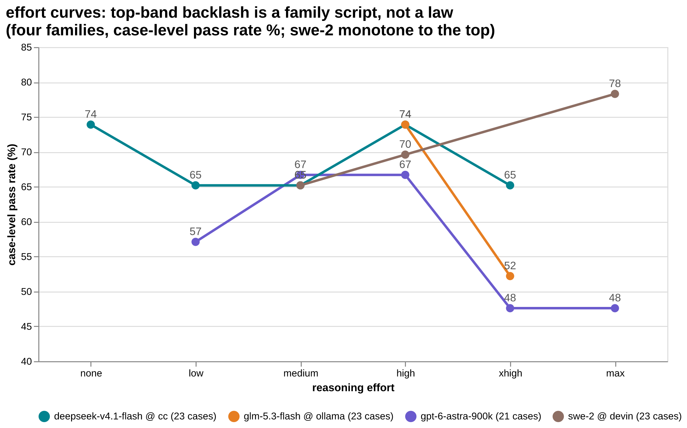
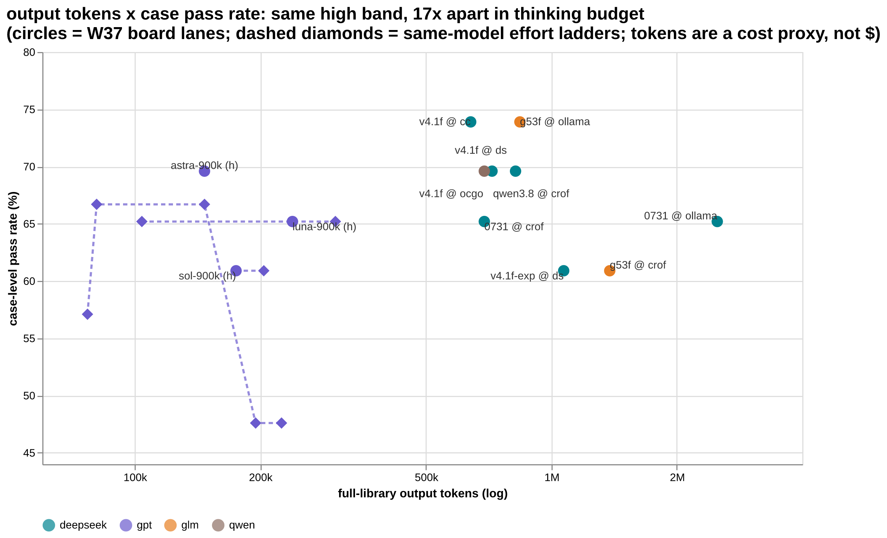

# AMBER — Sealed-in-Amber Historical Replay Evaluation

`Seal the scene in amber. Retake the exam of that moment.`

**Library** 23 cases / 26 papers · **Spec** v0.2.2 (draft) · **Hash index** [v2026-09](hash-index/v2026-09.md) · **Result repos** × 7 · **Rule** scores always public, cases never

中文说明：[README.md](README.md). The normative document is [AMBER-Core-Specification.md](AMBER-Core-Specification.md).

## What this is

A formal evaluation method. Take a **real, auditable** historical incident and rebuild the scene exactly as it stood before the answer was known. The candidate gets only the information available at that moment; all later evidence and scoring material is **physically sealed**. It diagnoses, decides, acts, abstains, refuses, or escalates. The rubric is frozen before anyone sees the output. Everything is archived, and everything can be audited.

## AMBER in three minutes (for first-time visitors)

**① Current top three** — the same model name on a different endpoint can be a different brain, so we record scores per endpoint × name:

**② Completion profile: same score, different shape** — two lanes tied at 17/23 with completely different nine-axis profiles (pin-level completion; negative d2 scores still count):

**③ What it is** — a private case library plus public scores: the cases never go public, the scores and hashes always do.

**④ How a result is produced** — it works like an exam: papers sealed at authoring, sat in a clean room, audited paper by paper, published redacted, checkable by anyone.

**⑤ A counterintuitive finding, with limits** — on the families measured so far, high is the sweet spot and top bands backfire (three of the four families plotted). A pattern, not a law: swe-2's band curve is monotone to the top (medium 15 < high 16 < max 18, [amber-devin W37](https://github.com/getaskclaw/amber-devin/blob/main/results/2026-W37.md)), and on some models the band barely moves the score — pick your band by cost and speed, not score.

**⑥ Score vs thinking budget** — same band (high), same library, and the output-token bill spans 17× (147K vs 2.5M) for scores within a case of each other (token totals from each lane's published issue). The axis is tokens, not dollars: billing is mixed (subscription lanes have no marginal price; the devin lane reports no usage at all, so swe-2 sits this one out). Within a family, more tokens bought no score (luna flat; astra's top bands lose four cases); across families the shape varies — which is why ⑤ is a pattern, not a law.

Chart sources (`.puml` for PlantUML, `.vega-lite.json` / `.vg.json` for Vega) sit next to the PNGs in `docs/images/` — edit a source, re-render, done.

## Why

Public benchmarks are frozen, public corpora: training contamination is rampant and unauditable, scores keep inflating, and static Q&A can't measure what real work demands — multi-step diagnosis, abstention, refusal, escalation under uncertainty. AMBER replays **provenance-controlled** real events whose leak status can be checked. It runs alongside public benchmarks; it doesn't replace them.

## Two caveats that won't go away

- **Runtime sealing ≠ training-data purity**: we seal runtime evidence; we can't prove the model never saw the future in training.
- **A historical outcome is evidence, not the one correct answer.**

## Status

Draft v0.2.2. The Core spec is stable; `schemas/`, `profiles/`, and the case-building/runner tooling are **not yet published**, so you can't execute a compliant run from this repo alone yet. Roadmap and milestones: [PLAN.md](PLAN.md).

## Contents

- [AMBER-Core-Specification.md](AMBER-Core-Specification.md) — the normative spec: purpose, definitions, mechanisms, 8 invariants, 8 boundaries, epistemic limits, naming review, adoption rules
- [protocols/distribution.md](protocols/distribution.md) — cross-host case distribution protocol (v0.3): public/private channel split, fixed-form git bundles, detached signature manifests, public index, sealing probes, leak-window adjudication, run records, comparability and verification matrices
- [hash-index/v2026-09.md](hash-index/v2026-09.md) — the public hash index: alias + bundle/oracle dual hashes for every case in the current library (23 cases); every results-repo matrix is checked against it
- [PLAN.md](PLAN.md) — status, milestones (case tooling → reference runner → scoring/adjudication → statistics → public index), open design questions
- [CONTRIBUTING.md](CONTRIBUTING.md) — contribution rules: **this repo never accepts case content**, document versioning and revision policy, what byte-hash-locking the Core spec means

## Weekly results (sister repos)

Scores and cases are published separately: results are public, cases never are. These repos run the full library weekly (aliases + bundle hashes verifiable against the [public hash index](hash-index/v2026-09.md)):

- [amber-crof](https://github.com/getaskclaw/amber-crof) — CrofAI models
- [amber-commandcode](https://github.com/getaskclaw/amber-commandcode) — CommandCode models
- [amber-deepseek](https://github.com/getaskclaw/amber-deepseek) — official DeepSeek API models
- [amber-devin](https://github.com/getaskclaw/amber-devin) — Devin models
- [amber-ollama](https://github.com/getaskclaw/amber-ollama) — Ollama Cloud models
- [amber-opencode](https://github.com/getaskclaw/amber-opencode) — OpenCode Go models
- [amber-gpt](https://github.com/getaskclaw/amber-gpt) — GPT-family models × reasoning-effort bands

**Current top three** (as of 2026-W37, full 23-case library¹):

| # | model @ endpoint | pass | source |
|---|---|---|---|
| 1 | swe-2-max @ Devin | 18/23 | [amber-devin W37](https://github.com/getaskclaw/amber-devin/blob/main/results/2026-W37.md) |
| 2 | glm-5.3-flash @ Ollama Cloud | 17/23 | [amber-ollama W37](https://github.com/getaskclaw/amber-ollama/blob/main/results/2026-W37.md) (tied: deepseek-v4.1-flash @ CommandCode, [amber-commandcode W37](https://github.com/getaskclaw/amber-commandcode/blob/main/results/2026-W37.md)) |
| 3 | gpt-6-astra-900k @ OpenAI Codex | 16/23 | [amber-gpt W37](https://github.com/getaskclaw/amber-gpt/blob/main/results/2026-W37.md) (tied: qwen3.8-27b @ CrofAI, [amber-crof W37](https://github.com/getaskclaw/amber-crof/blob/main/results/2026-W37.md); deepseek-flash @ OpenCode Go, [amber-opencode W37](https://github.com/getaskclaw/amber-opencode/blob/main/results/2026-W37.md); deepseek-flash @ DeepSeek official, [amber-deepseek W37](https://github.com/getaskclaw/amber-deepseek/blob/main/results/2026-W37.md); swe-2-high @ Devin, [amber-devin W37](https://github.com/getaskclaw/amber-devin/blob/main/results/2026-W37.md)) |

Not yet on the board: Fable, kimi-k3 and friends — this week's token budget didn't stretch to their exam fees; they sit the library as soon as the budget lands, and scores publish with the next issue.

¹ Since 2026-09-08 the board runs on the full 23-case library: CrofAI/Ollama/astra sat makeup runs of the 2 ops cases added 09-07 (12/12 papers wire- and hash-verified). astra's 16/23 = W36 -900k 14 cases + a W37 makeup on bare gpt-6-astra (the -900k variant was revoked server-side; the mixed lineage is noted in the issue). Added 2026-09-10: a three-lane duel on DeepSeek V4.1-Flash's GA day — the CommandCode and OpenCode Go relays plus the official DeepSeek API, same day, same band, full library (26/26 papers wire-verified each; CommandCode 17/23 joins the #1 tie, OpenCode Go and the official lane 16/23 join #2 — result repos in the table). Added 2026-09-11: swe-2-max @ Devin takes the board at 18/23 (16/21 on the public 21-case subset) — band curve monotone to the top (medium 15 < high 16 < max 18), the first-ever OPS 6/6 sweep, at ~5 h wall clock, roughly 4× the previous leader's (25/25 sessioned rows wire-verified, hashes 26/26 against the public index); swe-2-high 16/23 joins the #3 tie. The devin lane's harness does not forward effort — the true band is the UID suffix — and the lane reports no token usage. Out / not in: glm-5.3-flash @ CrofAI 14/23 (former #3 tie), devin swe-1-7-medium 14/23, deepseek-v4.1-flash-exp (preview, official lane) 14/23, gpt-5.6-sol-900k 14/23, gpt-5.6-luna-900k 15/23, deepseek-v4-flash-0731 @ CrofAI 15/23, deepseek-v4-flash:0731 @ Ollama Cloud 15/23 (former #3 tie), swe-2-medium 15/23 (best-ever vision 4.0).

## How to read a results matrix

Every issue is a single `results/YYYY-Www.md` built around a matrix. Five things to know:

- **Alias (A-xxxxxxxx)** — the case's public handle. Internal case numbers never appear, so scores can't be reverse-engineered into case content.
- **bundle_sha** — the content hash of the case bundle. Match it against the [hash index](hash-index/v2026-09.md): identical means the library hasn't changed.
- **✓ / ✗ (case level)** — the pass line is "all required checks green": 8/9 still fails — a defense that leaks one pin leaks.
- **d2 (review/vision cases)** — hits − false positives − flattery − verdict penalty. Positive is hard; negative is common.
- **Comparability trio** — compare only at the same effort band and same library version, and read the date; the same model name on another endpoint may be another brain. One day's number is a snapshot, not a law.

## FAQ

**If cases are private, why trust the scores?** Trust comes from the chain, not from showing you the paper: clean-room profiles (no fallback chain), per-paper wire audits (every call reconciled; a substitute call voids the paper), a closing gate (zero pollution or nothing ships), alias + hash publishing (you can verify the library is unchanged, case by case), and a per-issue harness pin (current runs: [Hermes](https://github.com/NousResearch/hermes-agent), version + upstream commit pinned in every issue). Verifiable process is what makes up for secret cases.

**Why keep cases private at all?** Public corpora get eaten by training data; scores inflate and become unauditable. That's the chronic disease of public benchmarks. Private cases make leak status checkable.

**Can I compare two models' scores directly?** Only at the same band and same library version, ideally the same day. Cross-week comparisons must carry explicit date and band declarations (pinned in every issue); cross-repo citations likewise.

**Can I reproduce or join?** Not from the public repos alone yet (spec v0.2.2 draft; `schemas/`, `profiles/`, and tooling unpublished — see [PLAN.md](PLAN.md)). Follow the result repos for scores; methodology questions are welcome as issues.

## License

Apache-2.0 — see [LICENSE](LICENSE).
