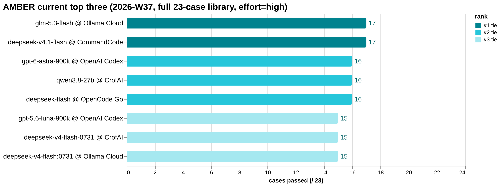
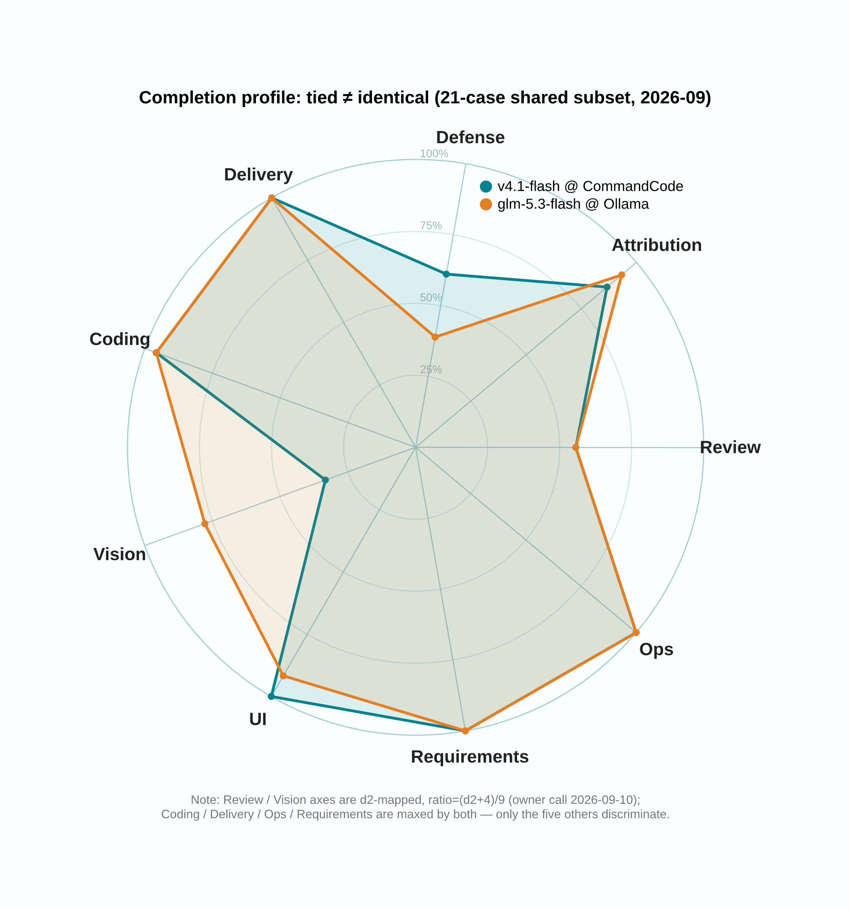
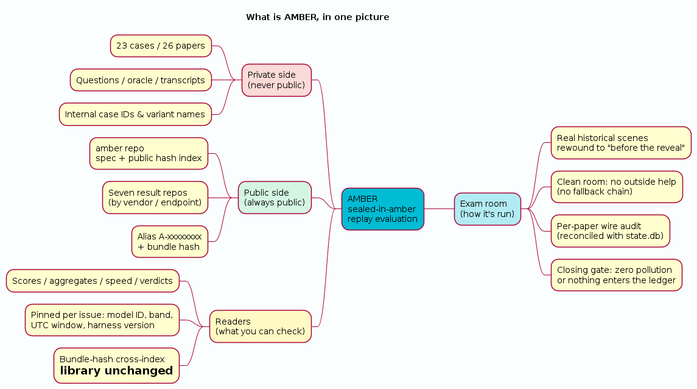
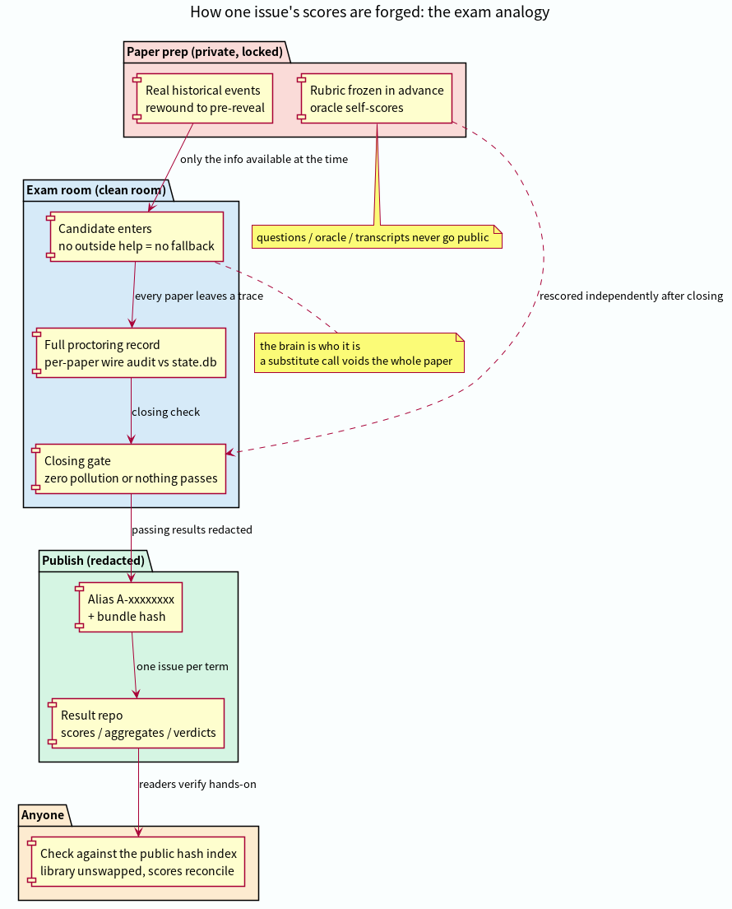
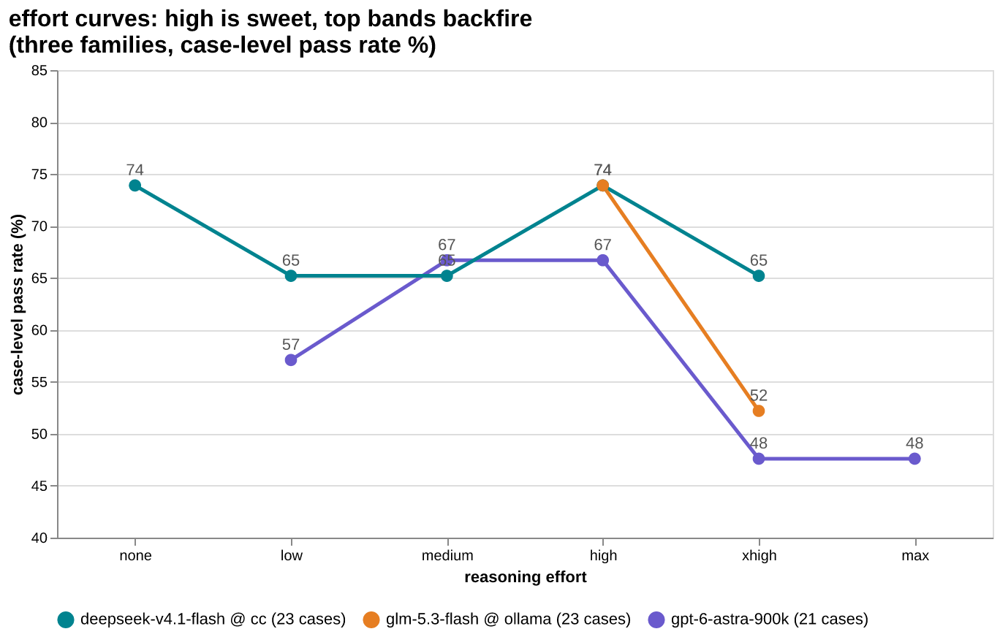

# AMBER — Sealed-in-Amber Historical Replay Evaluation

`Seal the scene in amber. Sit the exam of that moment, again.`

**Library** 23 cases / 26 papers · **Spec** v0.2.2 (draft) · **Hash index** [v2026-09](hash-index/v2026-09.md) · **Result repos** × 7 · **Rule** scores public, cases never

中文说明:[README.md](README.md). The normative document is [AMBER-Core-Specification.md](AMBER-Core-Specification.md).

## What this is

A formal evaluation method: take a **real, auditable** historical incident and reconstruct the scene exactly as of "before the answer was known". The candidate receives only the information available at that moment; all later evidence and scoring material is **physically sealed**. The candidate diagnoses, decides, acts, abstains, refuses, or escalates. Scoring criteria are frozen before any output is seen. Everything is archived and auditable.

## AMBER in three minutes (for first-time visitors)

**① Current top three** — the same model name on a different endpoint can be a different brain, so scores are recorded per endpoint × name:

**② Completion profile: a tie is not a twin** — two lanes tied at #1, completely different nine-axis profiles (pin-level completion; negative d2 scores also graded):

**③ What it is** — private case library + public scores: cases are never published, scores and hashes always are.

**④ How a result is produced** — like an exam: sealed authoring, clean-room sitting, per-paper wire audit, redacted publishing, public verification.

**⑤ A counterintuitive finding** — more thinking ≠ better scores: high is the sweet spot and top bands backfire (same law across four model families); on some models the band isn't even a score variable.

Sources next to the PNGs in `docs/images/` (`.puml` for PlantUML, `.vega-lite.json` / `.vg.json` for Vega) — edit the source and re-render to update.

## Why

Public benchmarks are static public corpora: training contamination is rampant and unauditable, scores inflate, and static Q&A doesn't measure what real work demands — multi-step diagnosis, abstention, refusal, escalation under uncertainty. AMBER replays **provenance-controlled** real events whose leak status is checkable. It runs alongside public benchmarks, never replaces them.

## Two irreducible caveats

- **Runtime sealing ≠ training-data purity**: we seal runtime evidence; we cannot prove the model never saw the future in training.
- **A historical outcome is evidence, not the single correct answer.**

## Status

Draft v0.2.2. The Core spec is stable; `schemas/`, `profiles/`, and case-building/runner tooling are **not yet published** — a compliant run cannot be executed from this repo alone. Roadmap and milestones: [PLAN.md](PLAN.md).

## Contents

- [AMBER-Core-Specification.md](AMBER-Core-Specification.md) — the normative spec: purpose, definitions, mechanisms, 8 invariants, 8 boundaries, epistemic limits, naming review, adoption rules
- [protocols/distribution.md](protocols/distribution.md) — cross-host case distribution protocol (v0.3): public/private channel split, fixed-form git bundles, detached signature manifests, public index, sealing probes, leak-window adjudication, run records, comparability and verification matrices
- [hash-index/v2026-09.md](hash-index/v2026-09.md) — public hash index: alias + bundle/oracle dual hashes for the current library (23 cases); every results-repo matrix is checked against it
- [PLAN.md](PLAN.md) — status, milestones (case tooling → reference runner → scoring/adjudication → statistics → public index), open design questions
- [CONTRIBUTING.md](CONTRIBUTING.md) — contribution rules: **this repo never accepts case content**, document versioning and revision policy, what byte-hash-locking the Core spec means

## Weekly results (sister repos)

Scores and cases are published separately: results are public, cases never are. Weekly full-library runs (aliases + bundle hashes verifiable against the [public hash index](hash-index/v2026-09.md)):

- [amber-crof](https://github.com/getaskclaw/amber-crof) — CrofAI models
- [amber-commandcode](https://github.com/getaskclaw/amber-commandcode) — CommandCode models
- [amber-deepseek](https://github.com/getaskclaw/amber-deepseek) — official DeepSeek API models
- [amber-devin](https://github.com/getaskclaw/amber-devin) — Devin models
- [amber-ollama](https://github.com/getaskclaw/amber-ollama) — Ollama Cloud models
- [amber-opencode](https://github.com/getaskclaw/amber-opencode) — OpenCode Go models
- [amber-gpt](https://github.com/getaskclaw/amber-gpt) — GPT-family models × reasoning-effort bands

**Current top three** (as of 2026-W37, full 23-case library¹, effort=high):

| # | model @ endpoint | pass | source |
|---|---|---|---|
| 1 | glm-5.3-flash @ Ollama Cloud | 17/23 | [amber-ollama W37](https://github.com/getaskclaw/amber-ollama/blob/main/results/2026-W37.md) (tied: deepseek-v4.1-flash @ CommandCode, [amber-commandcode W37](https://github.com/getaskclaw/amber-commandcode/blob/main/results/2026-W37.md)) |
| 2 | gpt-6-astra-900k @ OpenAI Codex | 16/23 | [amber-gpt W37](https://github.com/getaskclaw/amber-gpt/blob/main/results/2026-W37.md) (tied: qwen3.8-27b @ CrofAI, [amber-crof W37](https://github.com/getaskclaw/amber-crof/blob/main/results/2026-W37.md); deepseek-flash @ OpenCode Go, [amber-opencode W37](https://github.com/getaskclaw/amber-opencode/blob/main/results/2026-W37.md); deepseek-flash @ DeepSeek official, [amber-deepseek W37](https://github.com/getaskclaw/amber-deepseek/blob/main/results/2026-W37.md)) |
| 3 | gpt-5.6-luna-900k @ OpenAI Codex | 15/23 | [amber-gpt W37](https://github.com/getaskclaw/amber-gpt/blob/main/results/2026-W37.md) (tied: deepseek-v4-flash-0731 @ CrofAI, deepseek-v4-flash:0731 @ Ollama Cloud) |

¹ Since 2026-09-08 the board runs on the full 23-case library: CrofAI/Ollama/astra made up the 2 ops cases added 09-07 (12/12 papers wire- and hash-verified). astra's 16/23 = W36 -900k 14 cases + W37 bare-base makeup (-900k variant revoked server-side; mixed lineage noted in the issue). Added 2026-09-10: DeepSeek V4.1-Flash GA-day three-lane duel — CommandCode / OpenCode Go relays and the official DeepSeek API, same day same band full library (26/26 papers wire-verified each; CommandCode 17/23 ties #1, OpenCode Go and the official lane 16/23 tie #2 — result repos in the table). Out/not in: glm-5.3-flash @ CrofAI 14/23 (former #3 tie), devin swe-1-7-medium 14/23, deepseek-v4.1-flash-exp (preview, official lane) 14/23, gpt-5.6-sol-900k 14/23.

## How to read a results matrix

Each issue is one `results/YYYY-Www.md` built around a matrix. Five keys:

- **Alias (A-xxxxxxxx)** — the public case handle. Internal case numbers never appear, so scores can't be reverse-engineered into case content.
- **bundle_sha** — content hash of the case bundle. Match it against the [hash index](hash-index/v2026-09.md): identical = the library hasn't changed.
- **✓ / ✗ (case level)** — the pass line is "all required checks green": 8/9 is still a fail — a defense that leaks one pin leaks.
- **d2 (review/vision cases)** — hits − false positives − praise − verdict penalty. Positive is hard; negative is common.
- **Comparability trio** — compare only at the same effort band, same library version, and read the date; the same model name on another endpoint may be another brain. A single day's number is a snapshot, not a law.

## FAQ

**If cases are private, why trust the scores?** Trust comes from the chain, not from showing the paper: clean-room profiles (no fallback chain), per-paper wire audits (every call reconciled; a substitute call voids the paper), a closing gate (zero pollution or nothing ships), and alias + hash publishing (you can verify the library is unchanged, case by case). Process verifiability compensates for case secrecy.

**Why keep cases private at all?** Public corpora get eaten by training data; scores inflate and become unauditable — the chronic disease of public benchmarks. Private cases make leak status checkable.

**Can I compare two models' scores directly?** Only at the same band, same library version, ideally same day. Cross-week comparisons must carry explicit date and band declarations (pinned in every issue); cross-repo citations likewise.

**Can I reproduce or join?** Not from the public repos alone yet (spec v0.2.2 draft; `schemas/`, `profiles/`, and tooling unpublished — see [PLAN.md](PLAN.md)). Follow the result repos for scores; methodology questions welcome as issues.

## License

Apache-2.0 — see [LICENSE](LICENSE).
