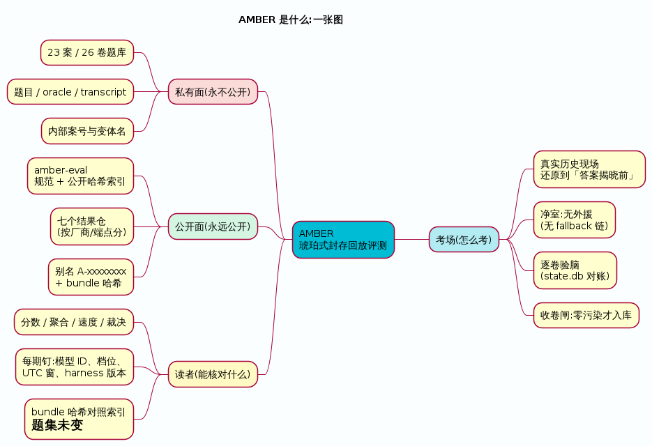
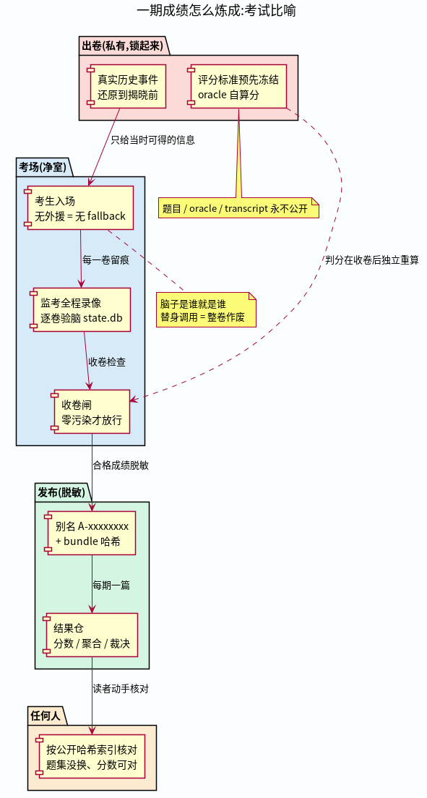
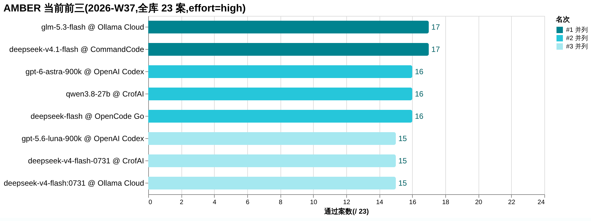

# AMBER — 琥珀式封存历史回放评测

`封进琥珀，重做当时的题。`

*English readers: the normative documents are in English — start with [AMBER-Core-Specification.md](AMBER-Core-Specification.md).*

## 这是什么

一种正式的评测方法：取一个**真实、可审计**的历史事件，把现场精确还原到"答案揭晓之前"那一刻；候选人只能拿到当时可得的信息，揭晓后的证据与评分材料全部**物理封存**；候选人诊断、决策、行动、弃权、拒绝或升级；评分标准在看到任何输出之前就已冻结；一切留档、可审计。

## 三分钟看懂 AMBER(给第一次来的你)

**① 它是什么** — 私有题库 + 公开成绩:题目永不公开,分数与哈希永远可查。

**② 一期成绩怎么炼成** — 像一场考试:出卷封存、净室应考、逐卷验脑、脱敏发布、人人可核对。

**③ 当前榜首** — 同名模型在不同端点可能是不同的脑,成绩按「端点 × 名字」记:

图源与重生成:`.puml`(PlantUML)与 `.vega-lite.json`(Vega-Lite)与 PNG 同目录,改数据改字直接改源再渲染。

## 为什么需要它

公开基准是静态公开题库：训练污染普遍且无法审计，分数持续通胀，而且静态问答测不出真实工作真正要求的能力——多步诊断、弃权、拒绝、不确定下的升级。AMBER 回放**来源受控**的真实事件，泄漏状态可核查。它与公开基准并行使用，永远不替代它们。

## 两条不可简化的警告

- **运行时密封 ≠ 训练数据纯净**：封存的是运行时证据，不证明模型训练时没见过未来事实。
- **历史结果是证据，不是唯一正解**。

## 状态

草案 v0.2.2。规范本体（Core）已稳定；`schemas/`、`profiles/` 与建案/运行工具**尚未发布**——目前仅凭本仓库还无法执行一次合规运行。建设路线与里程碑见 [PLAN.md](PLAN.md)。

## 内容

- [AMBER-Core-Specification.md](AMBER-Core-Specification.md) — 规范本体：目的、定义、机制、8 条不变量、8 条边界、认识论限制、命名评审、采用规则
- [protocols/distribution.md](protocols/distribution.md) — 案件跨主机分发协议（v0.3）：公开/私有频道划分、固定构造的 git bundle、分离式签名清单、公开索引、密封探针、泄漏窗口的裁定规则、运行记录、可比性与验证矩阵
- [hash-index/v2026-09.md](hash-index/v2026-09.md) — 公开哈希索引：当前评测题集(23 案)每案的别名 + bundle/oracle 双哈希;结果仓每期矩阵以此为准对照
- [PLAN.md](PLAN.md) — 状态、里程碑（建案工具 → 参考运行器 → 评分与裁判 → 统计 → 公开索引）、待决设计问题
- [CONTRIBUTING.md](CONTRIBUTING.md) — 贡献规则：**本仓库绝不接收案件内容**、规范文档的版本与修订政策、Core 规范按字节哈希锁定的含义

## 周测成绩(结果仓库)

成绩与题目分离发布:结果公开、题目永不公开。下列仓库按周发布全库实测(别名 + bundle 哈希对照本仓库[公开哈希索引](hash-index/v2026-09.md)):

- [amber-crof](https://github.com/getaskclaw/amber-crof) — CrofAI 在售模型周测
- [amber-commandcode](https://github.com/getaskclaw/amber-commandcode) — CommandCode 模型周测
- [amber-deepseek](https://github.com/getaskclaw/amber-deepseek) — DeepSeek 官方 API 模型周测
- [amber-devin](https://github.com/getaskclaw/amber-devin) — Devin 模型周测
- [amber-ollama](https://github.com/getaskclaw/amber-ollama) — Ollama Cloud 模型周测
- [amber-opencode](https://github.com/getaskclaw/amber-opencode) — OpenCode Go 模型周测
- [amber-gpt](https://github.com/getaskclaw/amber-gpt) — GPT 系模型 × 推理档位周测

**当前前三**(截至 2026-W37,全库 23 案¹,effort=high):

| # | 模型 @ 端点 | 通过 | 出处 |
|---|---|---|---|
| 1 | glm-5.3-flash @ Ollama Cloud | 17/23 | [amber-ollama W37](https://github.com/getaskclaw/amber-ollama/blob/main/results/2026-W37.md)（并列:deepseek-v4.1-flash @ CommandCode,[amber-commandcode W37](https://github.com/getaskclaw/amber-commandcode/blob/main/results/2026-W37.md)) |
| 2 | gpt-6-astra-900k @ OpenAI Codex | 16/23 | [amber-gpt W37](https://github.com/getaskclaw/amber-gpt/blob/main/results/2026-W37.md)（并列:qwen3.8-27b @ CrofAI,[amber-crof W37](https://github.com/getaskclaw/amber-crof/blob/main/results/2026-W37.md);deepseek-flash @ OpenCode Go,[amber-opencode W37](https://github.com/getaskclaw/amber-opencode/blob/main/results/2026-W37.md)) |
| 3 | gpt-5.6-luna-900k @ OpenAI Codex | 15/23 | [amber-gpt W37](https://github.com/getaskclaw/amber-gpt/blob/main/results/2026-W37.md)（并列:deepseek-v4-flash-0731 @ CrofAI、deepseek-v4-flash:0731 @ Ollama Cloud) |

¹ 2026-09-08 起表头从 21 案公共子集翻到全库 23 案:CrofAI/Ollama/astra 三道已补考 09-07 新增 2 运维案(12/12 卷验脑+bundle 哈希全绿)。astra 的 16/23 = W36 -900k 14 案 + W37 裸 gpt-6-astra 补考 2 案(-900k 变体已被服务端收回,口径混合已在期文标注)。2026-09-10 新增两道:DeepSeek V4.1-Flash GA 当日,CommandCode / OpenCode Go 两转发道同日同档全库对拍(各 26/26 卷验脑全绿,成绩仓新开,见上表)。跌出/未入:glm-5.3-flash @ CrofAI 14/23(原 #3 并列)、devin swe-1-7-medium 14/23、deepseek-v4.1-flash-exp(预览,官方道)14/23、gpt-5.6-sol-900k 14/23。

## 许可

Apache-2.0 — 见 [LICENSE](LICENSE)。
