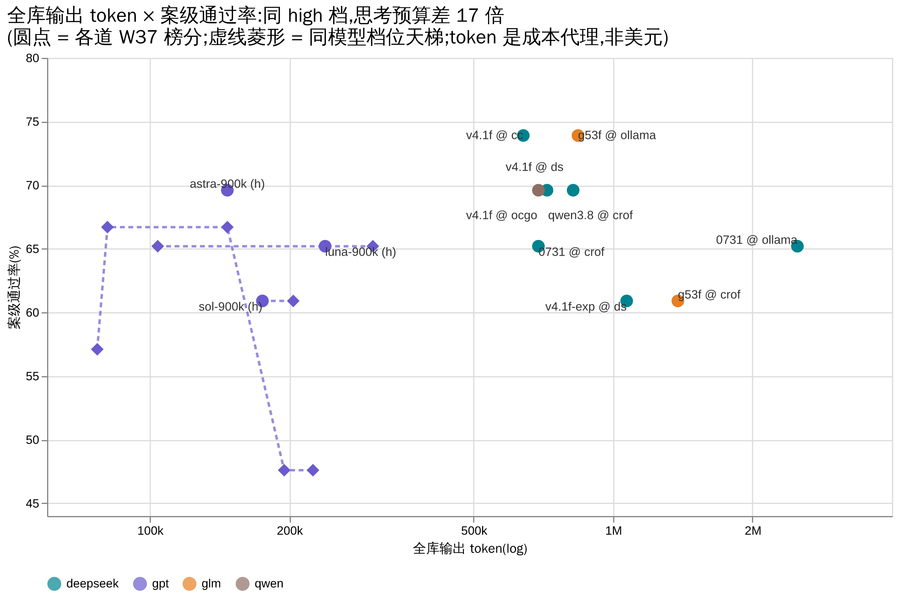

# AMBER — 琥珀式封存的历史回放评测

`封进琥珀，重做当时的题。`

**题集** 23 案 / 26 卷 · **规范** v0.2.2（草案） · **哈希索引** [v2026-09](hash-index/v2026-09.md) · **成绩仓** × 11 · **纪律** 只发分数，不发题

*English readers: the normative documents are in English — start with [AMBER-Core-Specification.md](AMBER-Core-Specification.md); repo orientation in English: [README.en.md](README.en.md).*

## 这是什么

一种正式的评测方法：取一个**真实、可审计**的历史事件，把现场精确还原到「答案揭晓之前」那一刻。应考者只能拿到当时可得的信息，揭晓后的证据与评分材料全部**物理封存**；诊断、决策、行动、弃权、拒绝、升级，都只能用当时的所知。评分标准在看到任何输出之前就已冻结，全程留档、可审计。

## 三分钟看懂 AMBER（给第一次来的你）

**① 当前榜首** —— **swe-2-max @ Devin，18/23**（2026-W37，全库 23 案，档线 medium 15 < high 16 < max 18）。同名模型换个端点，可能就是另一个脑：成绩一律按「端点 × 名字」记。

**② 完成度画像：同分 ≠ 同款** —— 17/23 现在是五家并列；九轴完成度矩阵五家同场，同分五种形状（钉级完成度；找茬分拿了负分也照记）。新补的 k3 行一眼读：UI 是空点（交付缺文件那案）、归因低于头部两家、视觉与 glm-5.3-flash 并列最高。09-16 再补 doubao 16/23 行：施工四轴（编码/交付/运维/需求）满格与头部对齐，但 UI/视觉空点、审查仅三分之一——形状是同场最偏科的一条；核验两轴（归因/防御）初扫考墙 ∅，3600s 补考落到真值 0.47/0.50（低分但真实，见 [amber-doubao W38 addendum](https://github.com/getaskclaw/amber-doubao/blob/main/results/2026-W38.md)）；找茬分负分按 0 落点。09-17 再补 gp27b 14/23 行（Qwen3.8-27B @ goldenpotato 社区自部署）：偏科比 doubao 更极端——施工组四轴贴着头部（编码 0.83 / 交付满 / 运维 0.97 / 需求满），审查/视觉/UI 三轴全零，归因/防御落在全场最低档；NVFP4 激进量化在动手面无损，在判断面全灭（[amber-goldenpotato W38](https://github.com/getaskclaw/amber-goldenpotato/blob/main/results/2026-W38.md)）：

**九轴怎么读（白话版）** —— 每格 = 该轴全部案子的完成度（0–1），按钉数折算：

- **编码** · 按菜谱做菜：照着需求把功能写对（6 案均分）
- **交付** · 做完 ≠ 交卷：没产出就是 0，思路再对也没用（1 案）
- **防御** · 保安巡夜：把校验器的漏网口全堵死，还不许误伤好人（2 案均分）
- **归因** · 医生按症状归病灶：每条毛病对到正确根因，张冠李戴扣钉（1 案 15 钉）
- **审查** · 当验收官：给别人的交付物挑错，漏看和冤枉都扣分，可为负（2 案，找茬分）
- **运维** · 照规程干脏活：备份、切换、对账，一步不省（6 案均分）
- **需求** · 客户说要 A 不要 B，交上去的得是 A（1 案）
- **UI** · 照设计稿做页面，像素级验收（1 案 12 钉）
- **视觉** · 给真截图挑毛病：元素重叠、画面裁切、缺图例——考它真看见了什么（1 案，找茬分）

轴随题库长：每进一族新案，矩阵就可能多一列——到时候照这张单子加一行。

**③ 它是什么** —— 私有题库 + 公开成绩：题目永不公开，分数与哈希永远可查。

**④ 一期成绩怎么炼成** —— 像一场考试：出卷封存、净室应考、逐卷验脑、脱敏发布、人人可核对。

**⑤ 一个反直觉发现，但有边界** —— 已测家族里「想更久 ≠ 考更好」：high 档是甜点，顶档反噬（图中四家族其三）。是经验规律，不是定律：swe-2 的档线单调到底（medium 15 < high 16 < max 18，见 [amber-devin W37](https://github.com/getaskclaw/amber-devin/blob/main/results/2026-W37.md)）；k3 是平线家族（low 15 ≈ high 17，差 2 案其一为骑线案抖动，token/墙钟约为 high 一半——选档按成本和速度，见 [amber-kimi W38](https://github.com/getaskclaw/amber-kimi/blob/main/results/2026-W38.md)）；也有的模型全档随机带，选档按成本和速度，不按分；WorkBuddy 道目前只考了 high 一档，尚无曲线可画。

**⑥ 分数 × 思考预算** —— 同 high 档、同全库，输出 token 账单跨 17 倍（147K vs 2.5M），分数却差不过一案（各道 token 数出自其期文）。横轴是 token 不是美元：各家计费混杂（订阅道没有边际价；devin 与 workbuddy 道都不上报用量，swe-2 与 wb 双模不上这张图）。家族内部，更多 token 没换来分（luna 平线、astra 顶档反噬）；家族之间形状各异——所以 ⑤ 只是经验规律。

**⑦ 高 TPS 只在简单题上成立** —— 同一题库、逐题耗时（log 轴）：厂商的高 TPS 是简单题上的吐字速度，难题想得多，吐字当场变慢，耗时跟着翻倍。点=一题，横线=中位数；题号匿名（编号对照留私域，逐点数据见 [wallclock-2026-w37.csv](docs/data/wallclock-2026-w37.csv)）。已测家族里，swe-2 档越高越慢但破题越多（medium 82s → max 280s，中位数）；v4.1-flash 顶档反噬（中位 68s 反掉两案）。形状因家族而异——这只是已测家族的样子，不是定律。

图的源文件（PlantUML 的 `.puml`、Vega 的 `.vega-lite.json` / `.vg.json`）就放在 PNG 同目录，改图 = 改源文件再渲染。

## 为什么需要它

公开基准是静态的公开题库：训练污染普遍且无法审计，分数持续通胀；静态问答也测不出真实工作要求的能力——多步诊断、弃权、拒绝、在不确定中升级。AMBER 回放**来源受控**的真实事件，泄漏状态可核查。它和公开基准互补，不取代它们。

## 两条绕不开的警告

- **运行时密封 ≠ 训练数据纯净**：我们封存的是运行时证据；模型训练时有没有见过未来，我们证明不了。
- **历史结果是证据，不是唯一正解**。

## 状态

草案 v0.2.2。Core 规范已稳定；`schemas/`、`profiles/` 和建案/运行工具**尚未发布**，目前仅凭本仓库无法执行一次合规运行。路线图与里程碑见 [PLAN.md](PLAN.md)。

## 内容

- [AMBER-Core-Specification.md](AMBER-Core-Specification.md) — 规范本体：目的、定义、机制、8 条不变量、8 条边界、认识论限制、命名评审、采用规则
- [protocols/distribution.md](protocols/distribution.md) — 案件跨主机分发协议（v0.3）：公开/私有频道划分、固定构造的 git bundle、分离式签名清单、公开索引、密封探针、泄漏窗口的裁定规则、运行记录、可比性与验证矩阵
- [protocols/stability.md](protocols/stability.md) — 稳定性协议草案（v0.1）：同臂复跑、失败后恢复率、副作用计数、基建废卷分列、样本量按决策反推
- [docs/instability-memo-2026-09-14.md](docs/instability-memo-2026-09-14.md) — $0 历史漂移证据 memo：900 个已发布矩阵格、31 个规范臂（转载列已标记），证明「分数快照 ≠ 稳定性」
- [docs/stage0-flip-analysis-2026-09-14.md](docs/stage0-flip-analysis-2026-09-14.md) — stage-0 翻转清单：17 条漂移/恢复事件（矩阵派生 + 散文标注），含 stage-1 筛查候选
- [docs/stage1-v001-screen-20260915.md](docs/stage1-v001-screen-20260915.md) — 首个设计型稳定性数据：`A-ea80d793` × `glm-5.3-flash@ollama` n=20 同臂复跑，8/20 过（~40%，判决纪律 20/20 稳定）——边界格案例须报分数分布而非二元翻转
- [docs/stage1-reqdrift-screen-20260915.md](docs/stage1-reqdrift-screen-20260915.md) — `A-0676097b` × `luna-high` n=5 复跑：3/5 过，回归在同一坐席复现两次且同为两个变体（变体名留私域）——升级分类边界案；协议新增多变体逐变体向量与 no-deliverable 分列
- [docs/stage1-sfail-screen-20260915.md](docs/stage1-sfail-screen-20260915.md) — 稳定挂科集 6 案 × `glm-5.3-flash@ollama` n=5 筛查：5 案零复活保住标签（A-87c472cb/A-d511f9e8 钉分纹丝不动），**A-d9b79b46 三过一挂标签被撕**（stage-2 n=20 已收：合计 6/20 过≈30%，Wilson [14.5%, 51.9%]——n=5 的 75% 过率是虚高，筛查档只有二元结论可信）；A-a317e74b 需 3600s 帽才能完卷——协议补逐案超时表与撞 billing 即停
- [docs/nine-axis-top3-2026-09-18.md](docs/nine-axis-top3-2026-09-18.md) — 九轴榜首（40 车道复算）：只有防御/归因/审查/视觉四轴有区分度，四个冠军分属四家厂商；其余五轴头部饱和并列
- [hash-index/v2026-09.md](hash-index/v2026-09.md) — 公开哈希索引：当前题集（23 案）每案的别名 + bundle/oracle 双哈希；结果仓每期矩阵以此为准对照
- [PLAN.md](PLAN.md) — 状态、里程碑（建案工具 → 参考运行器 → 评分与裁判 → 统计 → 公开索引）、待决设计问题
- [CONTRIBUTING.md](CONTRIBUTING.md) — 贡献规则：**本仓库绝不接收案件内容**、规范文档的版本与修订政策、Core 规范按字节哈希锁定的含义

## 周测成绩（结果仓库）

成绩与题目分开发布：结果公开，题目永不公开。以下仓库按周发布全库实测（别名 + bundle 哈希逐案对照本仓[公开哈希索引](hash-index/v2026-09.md)）：

- [amber-crof](https://github.com/getaskclaw/amber-crof) — CrofAI 在售模型周测
- [amber-commandcode](https://github.com/getaskclaw/amber-commandcode) — CommandCode 模型周测
- [amber-deepseek](https://github.com/getaskclaw/amber-deepseek) — DeepSeek 官方 API 模型周测
- [amber-devin](https://github.com/getaskclaw/amber-devin) — Devin 模型周测
- [amber-doubao](https://github.com/getaskclaw/amber-doubao) — 火山方舟 Agent Plan 豆包系模型实测
- [amber-kimi](https://github.com/getaskclaw/amber-kimi) — Kimi 官方 coding 端点模型周测
- [amber-ollama](https://github.com/getaskclaw/amber-ollama) — Ollama Cloud 模型周测
- [amber-opencode](https://github.com/getaskclaw/amber-opencode) — OpenCode Go 模型周测
- [amber-gpt](https://github.com/getaskclaw/amber-gpt) — GPT 系模型 × 推理档位周测
- [amber-workbuddy](https://github.com/getaskclaw/amber-workbuddy) — WorkBuddy（CodeBuddy）ACP 通道模型周测

**当前前五**（截至 2026-W38，全库 23 案¹）：

| # | 模型 @ 端点 | 通过 | 出处 |
|---|---|---|---|
| 1 | swe-2-max @ Devin | 18/23 | [amber-devin W37](https://github.com/getaskclaw/amber-devin/blob/main/results/2026-W37.md) |
| 2 | glm-5.3-flash @ Ollama Cloud | 17/23 | [amber-ollama W37](https://github.com/getaskclaw/amber-ollama/blob/main/results/2026-W37.md)（并列：deepseek-v4.1-flash @ CommandCode，[amber-commandcode W37](https://github.com/getaskclaw/amber-commandcode/blob/main/results/2026-W37.md)；deepseek-v4.1-flash @ Ollama Cloud，[amber-ollama W37 Addendum 09-11](https://github.com/getaskclaw/amber-ollama/blob/main/results/2026-W37.md)；hy4-preview-f @ WorkBuddy，[amber-workbuddy W37](https://github.com/getaskclaw/amber-workbuddy/blob/main/results/2026-W37.md)；k3 @ Kimi 官方 coding 端点，[amber-kimi W38](https://github.com/getaskclaw/amber-kimi/blob/main/results/2026-W38.md)） |
| 3 | gpt-6-astra-900k @ OpenAI Codex | 16/23 | [amber-gpt W37](https://github.com/getaskclaw/amber-gpt/blob/main/results/2026-W37.md)（并列：qwen3.8-27b @ CrofAI，[amber-crof W37](https://github.com/getaskclaw/amber-crof/blob/main/results/2026-W37.md)；deepseek-flash @ OpenCode Go，[amber-opencode W37](https://github.com/getaskclaw/amber-opencode/blob/main/results/2026-W37.md)；deepseek-flash @ DeepSeek 官方，[amber-deepseek W37](https://github.com/getaskclaw/amber-deepseek/blob/main/results/2026-W37.md)；swe-2-high @ Devin，[amber-devin W37](https://github.com/getaskclaw/amber-devin/blob/main/results/2026-W37.md)；doubao-seed-evolving @ 火山方舟 Agent Plan，[amber-doubao W38](https://github.com/getaskclaw/amber-doubao/blob/main/results/2026-W38.md)） |
| 4 | gpt-5.6-sol-900k @ OpenAI Codex | 15/23 | [amber-gpt W38](https://github.com/getaskclaw/amber-gpt/blob/main/results/2026-W38.md)（并列：gpt-5.6-luna-900k @ OpenAI Codex，[amber-gpt W38](https://github.com/getaskclaw/amber-gpt/blob/main/results/2026-W38.md)；deepseek-v4-flash-0731 @ CrofAI，[amber-crof W37](https://github.com/getaskclaw/amber-crof/blob/main/results/2026-W37.md)；deepseek-v4-flash:0731 @ Ollama Cloud，[amber-ollama W37](https://github.com/getaskclaw/amber-ollama/blob/main/results/2026-W37.md)；swe-2-medium @ Devin 与 swe-2-low @ Devin，[amber-devin W37](https://github.com/getaskclaw/amber-devin/blob/main/results/2026-W37.md)；deepseek-v4.1-flash @ WorkBuddy，[amber-workbuddy W37](https://github.com/getaskclaw/amber-workbuddy/blob/main/results/2026-W37.md)） |
| 5 | glm-5.3-flash @ CrofAI | 14/23 | [amber-crof W37](https://github.com/getaskclaw/amber-crof/blob/main/results/2026-W37.md)（并列：swe-1-7-medium @ Devin，[amber-devin W37](https://github.com/getaskclaw/amber-devin/blob/main/results/2026-W37.md)；deepseek-v4.1-flash-exp（预览）@ DeepSeek 官方，[amber-deepseek W37](https://github.com/getaskclaw/amber-deepseek/blob/main/results/2026-W37.md)；kimi-for-coding（K2.8 Preview）@ Kimi 官方 coding 端点，[amber-kimi W38](https://github.com/getaskclaw/amber-kimi/blob/main/results/2026-W38.md)；Qwen3.8-27B @ goldenpotato 社区自部署端点，[amber-goldenpotato W38](https://github.com/getaskclaw/amber-goldenpotato/blob/main/results/2026-W38.md)） |

暂未参评：Fable 等模型因 token 考费不足，本期未送上考场；考费到位即补考，成绩随期发布。（kimi-k3 已于 2026-09-15 首考入榜，见上表 #2 并列。）

¹ 2026-09-08 起，榜单口径从 21 案公共子集切换为全库 23 案：CrofAI / Ollama / astra 三条道已补考 09-07 新增的 2 个运维案（12/12 卷验脑 + bundle 哈希全绿）。astra 的 16/23 = W36 -900k 的 14 案 + W37 裸 gpt-6-astra 补考 2 案（-900k 变体已被服务端收回，口径混合已在期文中标注）。2026-09-10 新增：DeepSeek V4.1-Flash GA 当日三车道对拍——CommandCode / OpenCode Go 两条转发道与 DeepSeek 官方道，同日同档全库（各 26/26 卷验脑全绿；CommandCode 17/23 进入 #2 并列，OpenCode Go 与官方道 16/23 进入 #3 并列，成绩仓见上表）。2026-09-11 新增：deepseek-v4.1-flash @ Ollama Cloud 首考 17/23 入 #2 并列（同日复测 glm-5.3-flash 16/23，落在已知抖动带内；amber-ollama W37 Addendum）；swe-2-max @ Devin 18/23（公共 21 案子集 16/21）登顶——档线 medium 15 < high 16 < max 18 单调到底、OPS 面 6/6 全清（道内唯一；全场非首——gpt luna 与 ollama g53f 更早），墙钟约 5 小时 ≈ 前任榜首的 4 倍（25/25 会话行验脑、哈希 26/26 对公开索引）；swe-2-high 16/23 入 #3 并列。Devin 道 harness 不转发 effort，真实档 = UID 后缀；该道不上报 token 用量。跌出 / 未入：glm-5.3-flash @ CrofAI 14/23（原 #3 并列）、devin swe-1-7-medium 14/23、deepseek-v4.1-flash-exp（预览，官方道）14/23、gpt-5.6-sol-900k 15/23（2026-09-16 重测修正：UI 案原「零交付」实为 harness 客户端看门狗按提示文本量选档误杀静默推理中的健康请求，放宽补考真交付 12/12 满分；对拍旧跑零能力回退，详见 amber-gpt W38；上游 hermes-agent#112909）、gpt-5.6-luna-900k 15/23、deepseek-v4-flash-0731 @ CrofAI 15/23、deepseek-v4-flash:0731 @ Ollama Cloud 15/23（原 #3 并列）、swe-2-medium 15/23（视觉案 4.0 史上最高）、swe-2-low 15/23（与 medium 同分不同画像——保住 A-442d4aab 7/7 与 A-a317e74b 7/15 两个重判断案，丢运维考古案；2026-09-12 Addendum，26/26 验脑、23/23 哈希对公开索引）、deepseek-v4.1-flash @ WorkBuddy 15/23（见下）。2026-09-12 补：gpt-5.6-luna-900k 第三遍 high 15/23（挂科名单跨日 ±2 漂移，前三构成不变；sol 应 owner 要求暂停，9/26 未记分——该车道 09-16 已一次性全库新跑完成，15/23 零回退）。 2026-09-13 新增：WorkBuddy ACP 通道 W37 首考双模型——hy4-preview-f 17/23 入 #2 并列（OPS 6/6 全清、A-d9b79b46 12/12 满分；A-a317e74b 主跑撞 1800s 帽、3600s 帽补考 14/15 并列该案已发布第二高分，唯一过案为 crof q38 的 15/15）；deepseek-v4.1-flash 15/23 未入前三，但交出 A-be92627f 9/9——该案史上首个过案、核验面第二席（此前 15+ 条已发布成绩无一过案，最高 8/9；核验面首破为 crof q38 的 A-a317e74b 15/15）。验脑：82/82 usage 行全在钉住车道，A-ea80d793 两卷走 direct-acp 旁路（manifest 标注 `runner`）；23/23 哈希对公开索引。车道特性：token 用量不回传、effort 经 ACP set_config_option 侧通道钉入、原生工具面为 bypassPermissions。hy3 应 owner 要求中止，未记分。2026-09-15 新增：k3 @ Kimi 官方 coding 端点首考 17/23（公共 21 案子集 15/21）入 #2 并列——编码面 5/6（硬区分器 A-442d4aab 7/7 与 A-569dbe0d 10/10 双满分）、OPS 面 6/6 全清、视觉骑线案 A-ea80d793 3.0 过线；核验面 0/3、A-d9b79b46 交付缺文件、A-cdc3d11a -2。26/26 会话行核验 (k3, kimi-coding) 零替身、23/23 哈希对公开索引；26 卷墙钟 sum 约 2.8 小时（[amber-kimi W38](https://github.com/getaskclaw/amber-kimi/blob/main/results/2026-W38.md)）。2026-09-15 补：k3 同日 low 档 15/23——档线判平（挂科集与 high 仅差 2 案，其一为视觉骑线案压线抖动，token/墙钟均约为 high 一半）；k3 由此归入「平线家族」，选档按成本与速度不按分（[amber-kimi W38](https://github.com/getaskclaw/amber-kimi/blob/main/results/2026-W38.md)「档线复测」节）。2026-09-16 新增：doubao-seed-evolving @ 火山方舟 Agent Plan 首考 16/23 入 #3 并列——官方公告该通道与 Doubao-Seed-2.1-pro-0915 同版（套餐目录无版本锁定 ID，官方套餐文档实证）；形态极端分裂：施工/文本/运维/需求漂移 15 案细目分 92/94（97.9%）、hard 区分器 A-442d4aab 满分 7/7，审查/视觉/前端三案净 −2，核验系三案全部考墙零交付（3600s 大帽补考结果见其成绩仓 addendum）；reasoning tokens 占输出 65%、均卷墙钟 557s 约为同档 GPT 道 2 倍；23/23 会话行验脑钉 (doubao-seed-evolving, …/api/plan/v3) 零替身、0/26 哈希不符（[amber-doubao W38](https://github.com/getaskclaw/amber-doubao/blob/main/results/2026-W38.md)）。2026-09-17 新增：kimi-for-coding（K2.8 Preview，09-11 起该 ID 静默换脑）@ Kimi 官方 coding 端点首考 14/23（公共子集 12/21）未入前三——编码 / 文本 / 需求漂移三面与 k3 逐卷同分、墙钟快 27%，防御校验案 A-be92627f 7/9 反超 k3 的 4/9；但对抗审查案 A-cdc3d11a 拿 -17（k3 为 -2，幻觉洪水级，全场历史最差带），审查面判不可用；与 k3 的 3 案差全在已知抖动 / 骑线案带。26/26 卷验脑（净室 profile，零 fallback 替身）、26/26 哈希对公开索引（[amber-kimi W38 Addendum 09-17](https://github.com/getaskclaw/amber-kimi/blob/main/results/2026-W38.md)）。2026-09-17 补：gpt-5.6-luna-900k max 档首考 16/23——+1 案为 UI 案 A-d9b79b46 的 12/12 首交付（luna 成该案第五个满分已发布车道），但与 09-16 harness 看门狗修复同日混杂、任何档位重跑都会交付，剔除混杂后 15/23 与 high 打平，headline 15/23 不变（格级修正欠一次同档重测）；视觉案 A-ea80d793 拿 5.0 刷该案已发布历史最高（原纪录 swe-2-medium 4.0），归因案 A-a317e74b 14/15→7/15 顶档反噬再现（[amber-gpt W38 Addendum 4](https://github.com/getaskclaw/amber-gpt/blob/main/results/2026-W38.md)）。2026-09-17 新增：榜单展示从前三扩为前五——#4（15/23，七条并列道）与 #5（14/23，五条并列道）首次上表上图。同日新增：Qwen3.8-27B @ goldenpotato 社区自部署端点首考 14/23 入 #5 并列——个人玩家 3×V100 32G 魔改 vLLM TP3 跑 NVIDIA 官方 NVFP4 权重（KV cache FP8）；施工面 5/6 含 hard 区分器 A-442d4aab 满分 7/7，判断面（审查/核验/视觉/前端）零案通过；effort 旋钮实证无效（57 条用量记录 reasoning_tokens 全 0，按端点默认档记账）；端点为限时压测（公告称约一天），此行属一次性快照、不可复测；26/26 卷验脑钉 (Qwen3.8-27B, custom, 27b.goldenpotato.cn) 零替身、0/26 哈希不符（[amber-goldenpotato W38](https://github.com/getaskclaw/amber-goldenpotato/blob/main/results/2026-W38.md)）。

## 怎么读一期成绩（结果仓矩阵）

每个结果仓每期一篇 `results/YYYY-Www.md`，核心是一张矩阵。读法有五条：

- **别名（A-xxxxxxxx）** — 案件对外的公开称呼。内部案号永不出现，从分数反推不出题面。
- **bundle_sha** — 该案题面的内容哈希。与本仓[公开哈希索引](hash-index/v2026-09.md)逐案对照：一致 = 题集没换。
- **✓ / ✗（案级）** — 通过线是「必检项全绿」：8/9 也是挂——防线漏一颗钉就是漏。
- **找茬分（审查/视觉案）** — 命中 − 误报 − 恭维 − 判错罚分（最终结论判错方向再倒扣）。正分难得，负分常见。（成绩仓已发布期文与图表里它写作 `d2`，同一把尺。）
- **口径三件套** — 只在同 effort 档、同题集版本下对比，还要看日期；同名模型换个端点，可能就是另一个脑。单日数字是快照，不是定律。

## 常见问题

**题目不公开，凭什么信分数？** 信任不靠「把题给你看」，靠的是链条：净室考场（无 fallback 链）、逐卷验脑（每次调用对账，替身 = 整卷作废）、收卷闸（零污染才入库）、别名 + 哈希发布（你可逐案核对题集未变）、harness 身份每期公开钉账（现役 = [Hermes](https://github.com/NousResearch/hermes-agent)，版本 + commit 随期钉死）。题目保密的代价，用可验证的过程补回来。

**为什么不公开题目？** 公开题库会被训练数据吃掉，分数通胀、无法审计——这是公开基准的通病。题目私有，泄漏状态才可核查。

**两个模型的分能直接比吗？** 只在同档、同题集版本、尽量同日时可比。跨周对比必须带日期和档位声明（各期都钉了），跨仓引用同理。

**能复现或加入吗？** 目前不能：仅凭公仓还跑不通一次合规运行（规范 v0.2.2 草案，`schemas/`、`profiles/` 与工具未发布，见 [PLAN.md](PLAN.md)）。追结果请订阅上面的结果仓；方法论问题欢迎开 issue。

## 许可

Apache-2.0 — 见 [LICENSE](LICENSE)。
