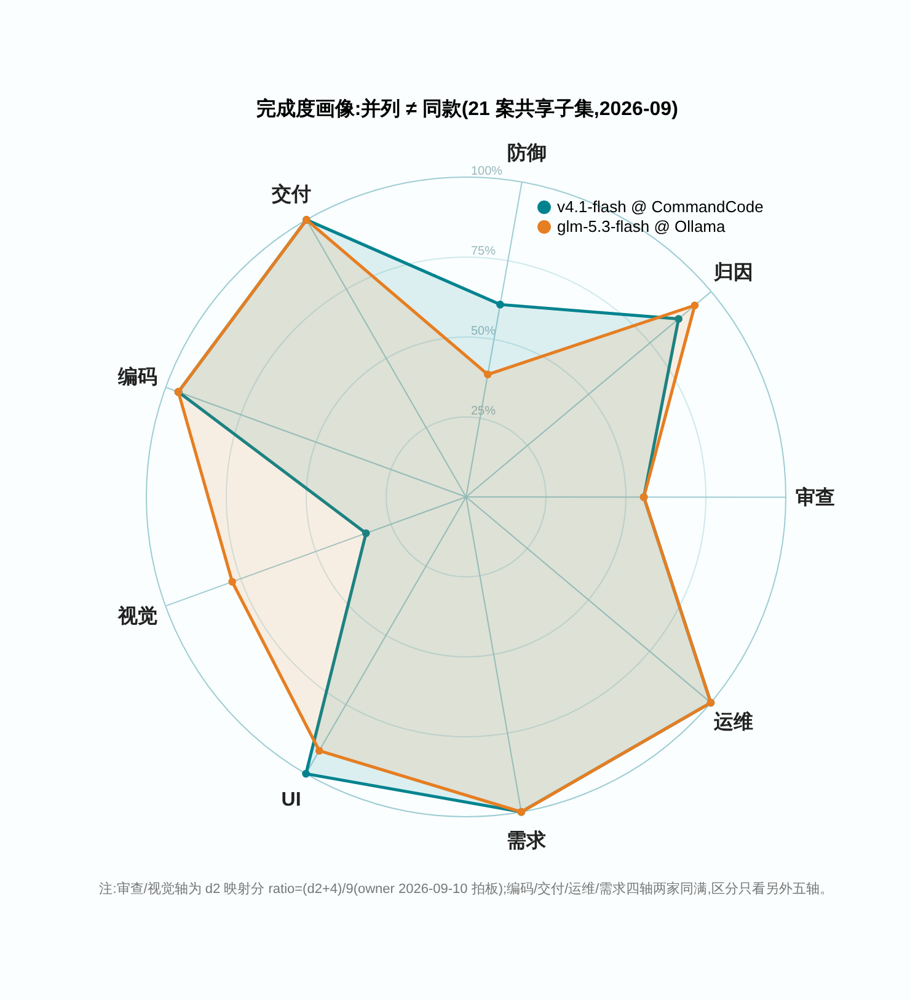
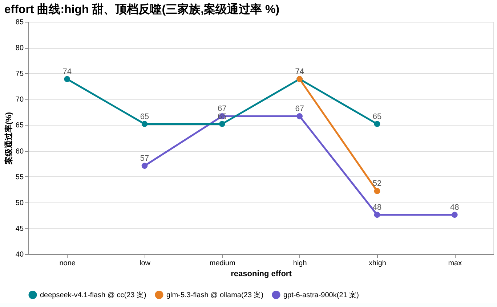

# AMBER — 琥珀式封存的历史回放评测

`封进琥珀，重做当时的题。`

**题集** 23 案 / 26 卷 · **规范** v0.2.2（草案） · **哈希索引** [v2026-09](hash-index/v2026-09.md) · **成绩仓** × 7 · **纪律** 只发分数，不发题

*English readers: the normative documents are in English — start with [AMBER-Core-Specification.md](AMBER-Core-Specification.md); repo orientation in English: [README.en.md](README.en.md).*

## 这是什么

一种正式的评测方法：取一个**真实、可审计**的历史事件，把现场精确还原到「答案揭晓之前」那一刻。应考者只能拿到当时可得的信息，揭晓后的证据与评分材料全部**物理封存**；诊断、决策、行动、弃权、拒绝、升级，都只能用当时的所知。评分标准在看到任何输出之前就已冻结，全程留档、可审计。

## 三分钟看懂 AMBER（给第一次来的你）

**① 当前榜首** —— 同名模型换个端点，可能就是另一个脑：成绩一律按「端点 × 名字」记。

**② 完成度画像：并列 ≠ 同款** —— 两家并列 #1，九轴画像完全不同（钉级完成度；d2 拿了负分也照记）：

**③ 它是什么** —— 私有题库 + 公开成绩：题目永不公开，分数与哈希永远可查。

**④ 一期成绩怎么炼成** —— 像一场考试：出卷封存、净室应考、逐卷验脑、脱敏发布、人人可核对。

**⑤ 一个反直觉发现** —— 「想更久 ≠ 考更好」：high 档是甜点，顶档反噬（四个模型家族同一条规律）；有的模型，档位根本不是成绩变量。

图的源文件（PlantUML 的 `.puml`、Vega 的 `.vega-lite.json` / `.vg.json`）就放在 PNG 同目录，改图 = 改源文件再渲染。

## 为什么需要它

公开基准是静态的公开题库：训练污染普遍且无法审计，分数持续通胀；静态问答也测不出真实工作要求的能力——多步诊断、弃权、拒绝、在不确定中升级。AMBER 回放**来源受控**的真实事件，泄漏状态可核查。它和公开基准互补，不取代它们。

## 两条绕不开的警告

- **运行时密封 ≠ 训练数据纯净**：我们封存的是运行时证据；模型训练时有没有见过未来，我们证明不了。
- **历史结果是证据，不是唯一正解**。

## 状态

草案 v0.2.2。Core 规范已稳定；`schemas/`、`profiles/` 和建案/运行工具**尚未发布**，目前仅凭本仓库无法执行一次合规运行。路线图与里程碑见 [PLAN.md](PLAN.md)。

## 内容

- [AMBER-Core-Specification.md](AMBER-Core-Specification.md) — 规范本体：目的、定义、机制、8 条不变量、8 条边界、认识论限制、命名评审、采用规则
- [protocols/distribution.md](protocols/distribution.md) — 案件跨主机分发协议（v0.3）：公开/私有频道划分、固定构造的 git bundle、分离式签名清单、公开索引、密封探针、泄漏窗口的裁定规则、运行记录、可比性与验证矩阵
- [hash-index/v2026-09.md](hash-index/v2026-09.md) — 公开哈希索引：当前题集（23 案）每案的别名 + bundle/oracle 双哈希；结果仓每期矩阵以此为准对照
- [PLAN.md](PLAN.md) — 状态、里程碑（建案工具 → 参考运行器 → 评分与裁判 → 统计 → 公开索引）、待决设计问题
- [CONTRIBUTING.md](CONTRIBUTING.md) — 贡献规则：**本仓库绝不接收案件内容**、规范文档的版本与修订政策、Core 规范按字节哈希锁定的含义

## 周测成绩（结果仓库）

成绩与题目分开发布：结果公开，题目永不公开。以下仓库按周发布全库实测（别名 + bundle 哈希逐案对照本仓[公开哈希索引](hash-index/v2026-09.md)）：

- [amber-crof](https://github.com/getaskclaw/amber-crof) — CrofAI 在售模型周测
- [amber-commandcode](https://github.com/getaskclaw/amber-commandcode) — CommandCode 模型周测
- [amber-deepseek](https://github.com/getaskclaw/amber-deepseek) — DeepSeek 官方 API 模型周测
- [amber-devin](https://github.com/getaskclaw/amber-devin) — Devin 模型周测
- [amber-ollama](https://github.com/getaskclaw/amber-ollama) — Ollama Cloud 模型周测
- [amber-opencode](https://github.com/getaskclaw/amber-opencode) — OpenCode Go 模型周测
- [amber-gpt](https://github.com/getaskclaw/amber-gpt) — GPT 系模型 × 推理档位周测

**当前前三**（截至 2026-W37，全库 23 案¹，effort=high）：

| # | 模型 @ 端点 | 通过 | 出处 |
|---|---|---|---|
| 1 | glm-5.3-flash @ Ollama Cloud | 17/23 | [amber-ollama W37](https://github.com/getaskclaw/amber-ollama/blob/main/results/2026-W37.md)（并列：deepseek-v4.1-flash @ CommandCode，[amber-commandcode W37](https://github.com/getaskclaw/amber-commandcode/blob/main/results/2026-W37.md)） |
| 2 | gpt-6-astra-900k @ OpenAI Codex | 16/23 | [amber-gpt W37](https://github.com/getaskclaw/amber-gpt/blob/main/results/2026-W37.md)（并列：qwen3.8-27b @ CrofAI，[amber-crof W37](https://github.com/getaskclaw/amber-crof/blob/main/results/2026-W37.md)；deepseek-flash @ OpenCode Go，[amber-opencode W37](https://github.com/getaskclaw/amber-opencode/blob/main/results/2026-W37.md)；deepseek-flash @ DeepSeek 官方，[amber-deepseek W37](https://github.com/getaskclaw/amber-deepseek/blob/main/results/2026-W37.md)） |
| 3 | gpt-5.6-luna-900k @ OpenAI Codex | 15/23 | [amber-gpt W37](https://github.com/getaskclaw/amber-gpt/blob/main/results/2026-W37.md)（并列：deepseek-v4-flash-0731 @ CrofAI、deepseek-v4-flash:0731 @ Ollama Cloud） |

¹ 2026-09-08 起，榜单口径从 21 案公共子集切换为全库 23 案：CrofAI / Ollama / astra 三条道已补考 09-07 新增的 2 个运维案（12/12 卷验脑 + bundle 哈希全绿）。astra 的 16/23 = W36 -900k 的 14 案 + W37 裸 gpt-6-astra 补考 2 案（-900k 变体已被服务端收回，口径混合已在期文中标注）。2026-09-10 新增：DeepSeek V4.1-Flash GA 当日三车道对拍——CommandCode / OpenCode Go 两条转发道与 DeepSeek 官方道，同日同档全库（各 26/26 卷验脑全绿；CommandCode 17/23 进入 #1 并列，OpenCode Go 与官方道 16/23 进入 #2 并列，成绩仓见上表）。跌出 / 未入：glm-5.3-flash @ CrofAI 14/23（原 #3 并列）、devin swe-1-7-medium 14/23、deepseek-v4.1-flash-exp（预览，官方道）14/23、gpt-5.6-sol-900k 14/23。

## 怎么读一期成绩（结果仓矩阵）

每个结果仓每期一篇 `results/YYYY-Www.md`，核心是一张矩阵。读法有五条：

- **别名（A-xxxxxxxx）** — 案件对外的公开称呼。内部案号永不出现，从分数反推不出题面。
- **bundle_sha** — 该案题面的内容哈希。与本仓[公开哈希索引](hash-index/v2026-09.md)逐案对照：一致 = 题集没换。
- **✓ / ✗（案级）** — 通过线是「必检项全绿」：8/9 也是挂——防线漏一颗钉就是漏。
- **d2（审查/视觉案）** — 命中 − 误报 − 恭维 − verdict 罚分。正分难得，负分常见。
- **口径三件套** — 只在同 effort 档、同题集版本下对比，还要看日期；同名模型换个端点，可能就是另一个脑。单日数字是快照，不是定律。

## 常见问题

**题目不公开，凭什么信分数？** 信任不靠「把题给你看」，靠的是链条：净室考场（无 fallback 链）、逐卷验脑（每次调用对账，替身 = 整卷作废）、收卷闸（零污染才入库）、别名 + 哈希发布（你可逐案核对题集未变）、harness 身份每期公开钉账（现役 = [Hermes](https://github.com/NousResearch/hermes-agent)，版本 + commit 随期钉死）。题目保密的代价，用可验证的过程补回来。

**为什么不公开题目？** 公开题库会被训练数据吃掉，分数通胀、无法审计——这是公开基准的通病。题目私有，泄漏状态才可核查。

**两个模型的分能直接比吗？** 只在同档、同题集版本、尽量同日时可比。跨周对比必须带日期和档位声明（各期都钉了），跨仓引用同理。

**能复现或加入吗？** 目前不能：仅凭公仓还跑不通一次合规运行（规范 v0.2.2 草案，`schemas/`、`profiles/` 与工具未发布，见 [PLAN.md](PLAN.md)）。追结果请订阅上面的结果仓；方法论问题欢迎开 issue。

## 许可

Apache-2.0 — 见 [LICENSE](LICENSE)。
